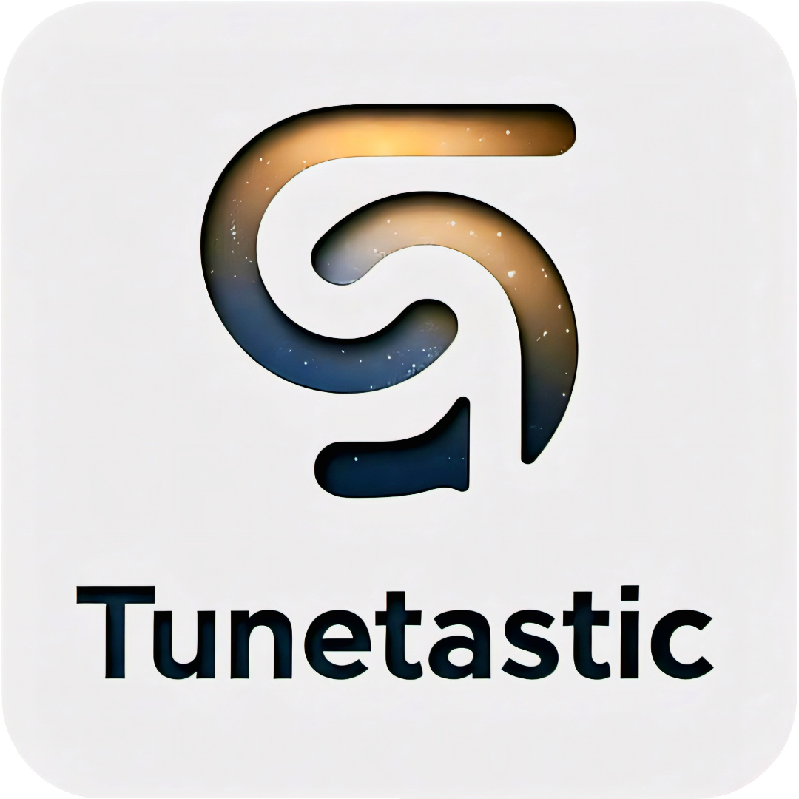

<div align="center">



# Tunetastic

**A next-gen music player for Windows 10 & 11**

*Sleek design meets deep personalization — your library, your experience.*

[](https://microsoft.com/windows)
[](https://learn.microsoft.com/en-us/windows/apps/winui/winui3/)
[](https://learn.microsoft.com/en-us/dotnet/csharp/)
[](LICENSE)

<a href="https://apps.microsoft.com/detail/9PCCNQZTD6PX?referrer=appbadge&mode=full" target="_blank"  rel="noopener noreferrer">
	
</a>

</div>

---

## Overview

Tunetastic is a modern music player built natively for Windows using WinUI 3. It brings Windows 11's design language — Mica, Acrylic, rounded corners, and fluid animations — to both Windows 10 and Windows 11, combining a beautifully crafted interface with deep customization options. Turn your local music library into an experience that's as unique, expressive, and captivating as the music you love.

> 


---

## Features

### 🎵 Player

The main player page is the heart of Tunetastic — a full-screen immersive experience built around your currently playing track.

- Dynamic blurred album art background (blur intensity adjustable)
- Standard playback controls: play/pause, previous, next, seek forward/rewind
- Shuffle and repeat modes
- Track progress bar with seek support

---

### 🎤 Lyrics

Tunetastic displays lyrics in sync with your music — no extra setup needed.

- **Synced lyrics** scroll automatically in time with playback, and are sourced from:
	- Embedded metadata inside the audio file itself
	- External `.lrc` files placed alongside the track (same folder, matching filename)

- **Unsynced lyrics** are displayed as plain scrollable text and are always read
from embedded metadata.

- Embedded lyrics can be edited/cleared in the app.

- When both an embedded source and an `.lrc` file are available, the embedded lyrics
takes priority for synced playback. If no lyrics are found.

- Synced Lyrics can be synchronized. Offsets have 2 modes which can be changed from settings. *Currently only embedded lyrics are supported for lyrics synchronization.*
   - *Official Standard* - Follows the formal LRC specification. Positive values subtract time to display lyrics sooner (advancing them), while negative values delay lyrics. Recommended for compatibility with spec-compliant files.
   - *Intuitive/Logical* (Default) - Applies straightforward timestamp addition. Positive values add time to delay lyrics, while negative values shift lyrics earlier. Ideal if you expect + to push lyrics forward into the timeline.

> 


---

### 🔊 Volume Control

Tunetastic gives you precise, flexible control over volume without ever leaving the app.

A dedicated volume slider sits right in the player UI, and can operate in two distinct modes — switchable at any time:

- **System Volume** — The slider controls your device's master output volume, in sync with the Windows volume flyout and taskbar speaker icon. Dragging it in Tunetastic is identical to dragging it from the system tray.
- **App Volume** — The slider controls only Tunetastic's volume as an independent channel, leaving all other audio on your system untouched. This maps directly to Tunetastic's entry in the Windows Volume Mixer, so changes made in either place are always reflected in the other in real time.

**Pause on Mute** — When enabled, Tunetastic will automatically pause playback the moment the volume reaches zero (whether muted via the in-app slider, the system mute key, or any other source), and will resume the instant sound is restored — no need to manually hit play again.

---

### 📚 Library

Tunetastic automatically organizes your music collection into clean, browsable views:

| View | Description |
|---|---|
| All Songs | Every track in your library |
| Artists | Grouped by artist name |
| Albums | Grouped by album, with artwork |
| Genres | Sorted by genre tag |
| Years | Sorted by release year |


---

### 🏷️ Tag Editor

Clean up and manage your music metadata without ever leaving Tunetastic or reaching for a third-party tool.

- Edit **all standard ID3 tags** — title, artist, album, genre, year, lyrics and cover/album art
- **Inline suggestions** appear as you type, drawn from data already in your library, so tags stay consistent across your collection instead of drifting into duplicates and typos (e.g. start typing an artist name and matching spellings already in your library show up)
- Embedded lyrics can also be edited or cleared from the same place *(see [Lyrics](#-lyrics))*

---

### 📋 Playlists

Smart playlists keep your most-reached-for music always at hand, and you can build your own on top of them.

**Built-in smart playlists:**
- **Recently Added** — Newest arrivals in your library
- **Recently Played** — Picks up right where you left off
- **Most Played** — Your personal all-time favorites

**User playlists:**
- Create your own playlists and give them any name
- Rename or delete user-created playlists at any time
- Add individual tracks, or bulk-add entire albums, genres, or years in one go

> 

---

### 🔍 Quick Search

A quick search bar sits in the top panel, letting you instantly search across your entire library by song title, artist, album, genre, or year — no need to navigate away from wherever you are.

---

### 🖥️ System Integration

Tunetastic integrates deeply with Windows for a native, seamless experience — all system integration features work on both Windows 10 and Windows 11 unless noted otherwise.

**🎛️ System Media Transport Controls (SMTC)**
Full SMTC support means you can control playback from anywhere:
- Windows notification / media flyout
- Any SMTC-compatible third-party app
- Keyboard media keys (play, pause, next, previous)
- Bluetooth headphones and controllers

> 


**🔒 Lock Screen Controls (Windows 11)**
On Windows 11, playback controls surface directly on the lock screen, so you can play/pause and skip tracks without ever unlocking your PC.

> 


**🖱️ Thumbnail Toolbar**
Tunetastic adds playback buttons directly to its taskbar thumbnail preview — the small popup that appears when you hover over the app on the taskbar. Without switching to the app, you can:
- Play or pause the current track
- Skip to the previous or next track

> 


It's the fastest way to manage playback when Tunetastic is sitting in the background.

**🪟 Taskbar Overlay Controls**
A playback overlay lives right on the taskbar itself, giving you controls at a glance without hovering for the thumbnail preview.
- Choose from several predefined layouts to match your taskbar and workflow
- More layouts are being added over time based on user requests

> 

> 

> 


**📊 Taskbar Progress**
Track playback progress is shown live on the Tunetastic taskbar icon, so you always know where you are in a track at a glance — without switching windows.

**🔔 System Tray**
- Minimize to the system tray on close, keeping Tunetastic out of the way but always ready
- **Click** the tray icon to play or pause instantly
- **Hover** the tray icon to see the current track and artist

---

## Settings

### 📁 Library Management

- **Add Folders** — Point Tunetastic to your local music directories
- **File Extensions** — Choose which audio formats to include
- **Minimum Track Duration** — Ignore files below a set length (great for skipping short intros or sound effects)
- **Duplicate Detection** — Options to detect and handle duplicate tracks
- **Show / Hide Library Views** — Independently toggle the visibility of Artists, Albums, Genres, Years, and each individual playlist (All Songs is always shown)
  - Note: Built-in smart playlists can be hidden; user-created playlists can be renamed or deleted

### 🎚️ Playback

- Crossfade between tracks with adjustable duration
- **Volume Mode** — Choose between System Volume and App Volume for the in-app slider
- **Pause on Mute** — Automatically pause playback when volume drops to zero, and resume when sound is restored
- Additional playback behavior settings

### 🎨 Appearance & Behavior

Tunetastic gives you fine-grained control over how it looks and feels.

**Theme**
Choose between Light, Dark, or follow the system setting.

**UI Material**
Pick the backdrop material used throughout the app:

| Material | Description |
|---|---|
| Mica | Subtle tinted blur sampling your desktop wallpaper |
| Mica Alt | A higher-contrast variation of Mica |
| Acrylic | Frosted-glass blur showing content behind the window |
| Acrylic Thin | A lighter, more transparent acrylic |
| Transparent | Fully transparent window background |

When **Mica** is selected, you can also dial in a custom tint color — anywhere from fully transparent to any color you choose.

> 

> 

> 

> 

> 

> 

> 


**Accent Color**
Certain player UI elements pick up your Windows accent color automatically. A shortcut to the Windows accent color settings page is available directly from within Tunetastic.

**Player Background**
Control the blur intensity of the album art background on the main player page.

**Rainbow Border**
Add an animated rainbow border to the player:
- Toggle on/off
- Configure when it appears (e.g., always, or only during playback)
- Adjust the animation speed

**Window Behavior**
- **Minimize to tray on close** — Keep Tunetastic running silently in the background instead of fully quitting

---

## Requirements

- **Windows 10** (version 1903 / Build 18362 or later) or **Windows 11**
- **.NET Framework 4.7** or later
- No additional runtime installation required — get it directly from the **Microsoft Store**


---

## Installation

### Microsoft Store *(Recommended)*

Search for **Tunetastic** in the [Microsoft Store](https://github.com/AMit-KP/Tunetastic/tree/master#tunetastic), or follow the store link once available. No manual setup or certificate trust required — just install and play.

### Github Releases *(Only Recommended if you want the latest version earlier)*

Open the [Releases](https://github.com/AMit-KP/Tunetastic/releases) page and download the Store Certificate(.cer) file and the MSIX file for your system architecture. Install the .cer file 1st (Valid for a year). Then, proceed to install the MSIX file.

### Building from Source

```bash
# Clone the repository
git clone https://github.com/AMit-KP/Tunetastic.git
cd tunetastic

# Open in Visual Studio 2026
start Tunetastic.sln
```

Ensure the following workloads are installed in Visual Studio 2026:
- **.NET desktop development**
- **Windows application development** (includes Windows App SDK)

Then press **F5** to build and run.

---

## Contributing

Contributions are welcome! Please open an issue to discuss what you'd like to change before submitting a pull request. Make sure your code follows the existing style and that all builds pass cleanly.

---

## License

This project is licensed under the [GNU General Public License v3.0](LICENSE).

---

<div align="center">

Made with ♥ for music lovers on Windows

</div>
